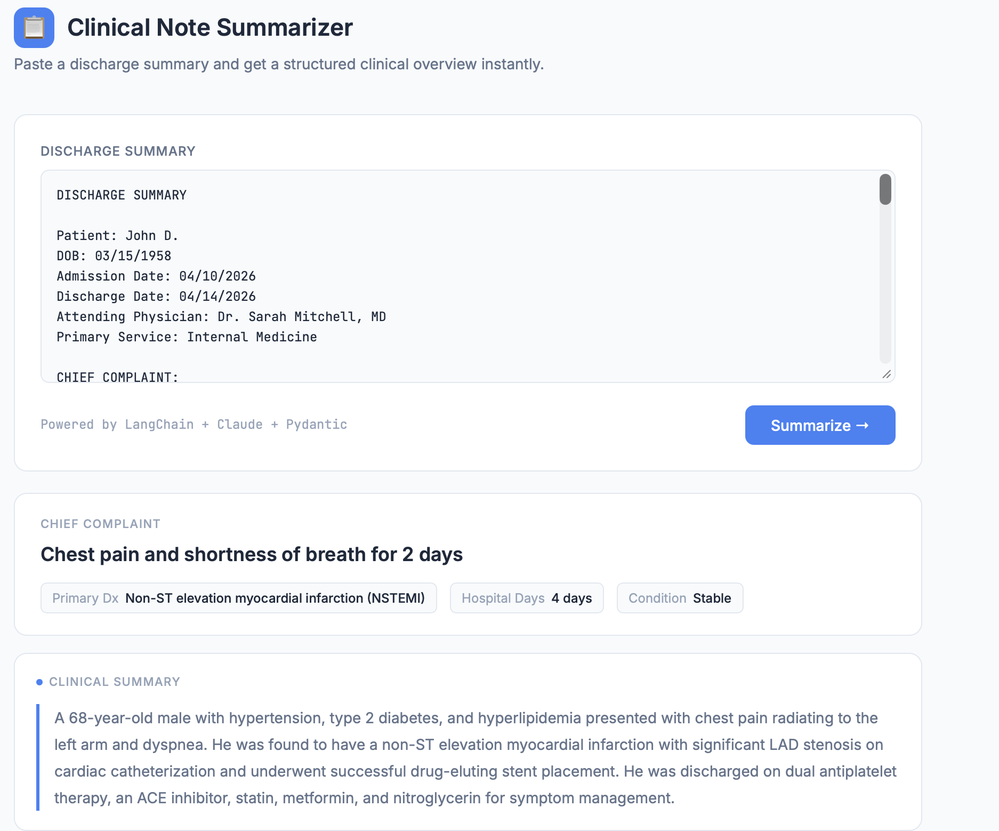
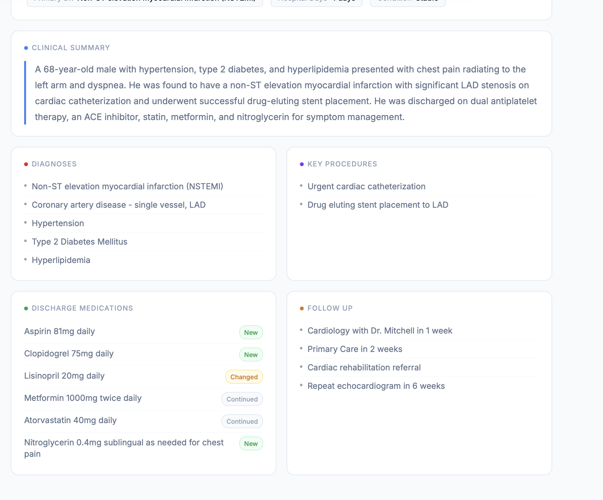

# Clinical Note Summarizer

A clinical AI tool that reads unstructured hospital discharge summaries and returns structured, actionable information — diagnoses, medications, procedures, and follow-up plans — in seconds.

Built with LangChain, Anthropic Claude, and Pydantic structured outputs.

---

## Demo

> Add your demo screenshot here

---

## What It Does

Paste a discharge summary and get back a clean structured overview:





---

## What Gets Extracted

From a raw discharge summary the agent extracts:

- Chief complaint and primary diagnosis
- All discharge diagnoses
- Key procedures performed
- Complete medication list with status — New, Changed, or Continued
- Follow-up appointments and referrals
- Hospital day count and discharge condition
- Plain English clinical summary

---

## Architecture

```
Raw discharge summary (free text)
        ↓
LangChain prompt template
        ↓
Claude (claude-haiku-4-5) reads and extracts
        ↓
PydanticOutputParser validates all fields
        ↓
DischargeSummary object returned
        ↓
FastAPI serves it to the HTML frontend
```

No database. No vector store. LangChain handles document processing and output parsing. Claude's medical training is the knowledge source.

---

## Tech Stack

| Layer | Tool |
|---|---|
| LLM | Anthropic Claude (claude-haiku-4-5) |
| Framework | LangChain + LangChain-Anthropic |
| Structured outputs | Pydantic |
| API layer | FastAPI + uvicorn |
| Frontend | Custom HTML/CSS/JS |
| Language | Python 3.13 |

---

## Sample Output

Given a discharge summary for a 68-year-old NSTEMI patient:

```json
{
  "chief_complaint": "Chest pain and shortness of breath for 2 days",
  "primary_diagnosis": "Non-ST elevation myocardial infarction (NSTEMI)",
  "all_diagnoses": [
    "NSTEMI",
    "Coronary artery disease - single vessel, LAD",
    "Hypertension",
    "Type 2 Diabetes Mellitus",
    "Hyperlipidemia"
  ],
  "key_procedures": [
    "Urgent cardiac catheterization",
    "Drug eluting stent placement to LAD"
  ],
  "discharge_medications": [
    "Aspirin 81mg daily",
    "Clopidogrel 75mg daily",
    "Lisinopril 20mg daily",
    "Metformin 1000mg twice daily",
    "Atorvastatin 40mg daily",
    "Nitroglycerin 0.4mg sublingual as needed"
  ],
  "new_medications": ["Aspirin", "Clopidogrel", "Nitroglycerin"],
  "changed_medications": ["Lisinopril increased from 10mg to 20mg"],
  "hospital_days": 4,
  "discharge_condition": "Stable"
}
```

---

## How to Run It

### 1. Clone the repo
```bash
git clone https://github.com/uvstharun/clinical-note-summarizer.git
cd clinical-note-summarizer
```

### 2. Set up environment
```bash
python3 -m venv venv
source venv/bin/activate
pip install -r requirements.txt
```

### 3. Add your Anthropic API key
```bash
touch .env
echo "ANTHROPIC_API_KEY=your_key_here" >> .env
```

### 4. Start the API
```bash
uvicorn api:app --reload --port 8000
```

### 5. Open the frontend
```bash
open summarizer_ui.html
```

Or test directly via the interactive API docs:
```
http://127.0.0.1:8000/docs
```

---

## Project Structure

```
clinical-note-summarizer/
├── summarizer.py        # LangChain chain + Pydantic schema + Claude call
├── api.py               # FastAPI backend — POST /summarize endpoint
├── summarizer_ui.html   # HTML frontend with color-coded medication tags
├── test_summarizer.py   # Test script with sample discharge note
├── requirements.txt
├── .env                 # API key (not tracked)
└── .gitignore
```

---

## Why This Project

Discharge summaries are one of the most information-dense and time-consuming documents in clinical care. A typical summary takes 5-10 minutes to read and extract key information from. This tool reduces that to seconds.

The medication status tagging — New, Changed, Continued — is particularly valuable for care transition workflows where medication reconciliation errors are a leading cause of preventable harm.

This project also demonstrates using LangChain for the first time after building the raw tool-calling loop manually in a prior project — which means every abstraction LangChain provides is understood, not just used.

---

## Author

**Vishnu Sai** — Data Scientist | Healthcare AI
[LinkedIn](https://www.linkedin.com/in/vishnusai29/) · [GitHub](https://github.com/uvstharun)